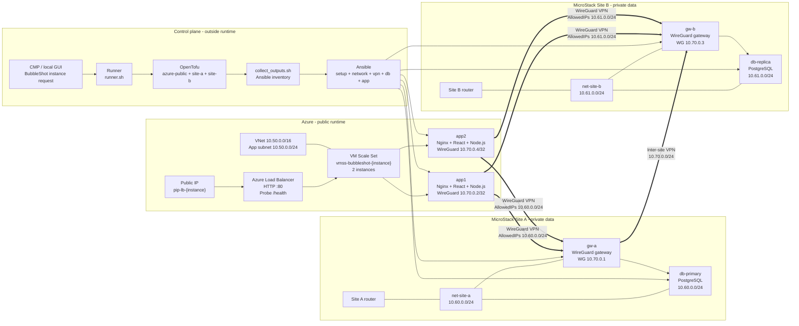
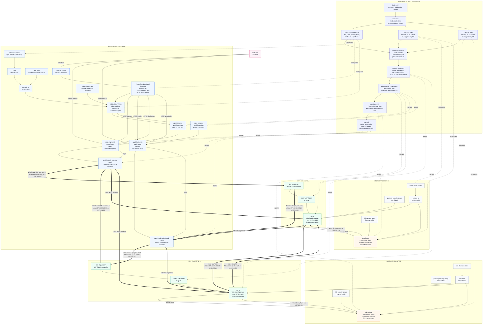

# BubbleShot - Hybrid Azure / MicroStack Infrastructure

> Hybrid cloud demonstration platform for deploying BubbleShot with a public Azure runtime, two private MicroStack sites, and application connectivity carried by a WireGuard VPN.

---

## Table of Contents

- [Overview](#overview)
- [Target Architecture](#target-architecture)
- [Global Diagram](#global-diagram)
- [Detailed Flow Diagram](#detailed-flow-diagram)
- [Architecture Principles](#architecture-principles)
- [Resilience Model](#resilience-model)
- [Repository Structure](#repository-structure)
- [Main Components](#main-components)
- [Deployment Flow](#deployment-flow)
- [Runtime Flows](#runtime-flows)
- [Technology Stack](#technology-stack)
- [Scope and Assumptions](#scope-and-assumptions)
- [Possible Improvements](#possible-improvements)
- [Educational Value](#educational-value)

---

## Overview

This repository contains the infrastructure, scripts, and Ansible configuration required to deploy **BubbleShot** on a hybrid cloud architecture.

The model is:

- **Azure** exposes the application publicly through a Load Balancer and a **Virtual Machine Scale Set**.
- **MicroStack Site A** and **MicroStack Site B** host the private data layer.
- **WireGuard** provides the VPN between the public runtime and the private sites.
- **OpenTofu** creates the cloud resources.
- **Ansible** configures networking, WireGuard, PostgreSQL, Nginx, and the application.

User traffic always enters through Azure. Application traffic to the databases stays inside the WireGuard VPN.

| Layer | Role | Technology |
|---|---|---|
| Public runtime | Web entrypoint, frontend, backend | Azure LB, VMSS, Nginx, React, Node.js |
| Private data layer | PostgreSQL databases isolated per site | MicroStack, PostgreSQL |
| Connectivity | Public-to-private application transport | WireGuard |
| Automation | Provisioning and configuration | OpenTofu, Ansible, Bash, Python |
| Operator interface | Launching and visualization | Runner CLI, local GUI |

---

## Target Architecture

The architecture is split into two planes:

```text
Control plane  ->  provisions, collects outputs, generates inventory, configures
Runtime plane  ->  serves BubbleShot and carries application flows through the VPN
```

The **control plane** does not serve users. It orchestrates Azure and MicroStack deployments, then applies configuration.

The **runtime plane** is made of an Azure Load Balancer, an application VMSS with two instances, and two private sites. Each application instance has its own WireGuard client and routes to the private data networks.

---

## Global Diagram



---

## Detailed Flow Diagram



---

## Architecture Principles

### 1. Public runtime backed by an Azure VMSS

Azure provides the public entrypoint for the BubbleShot instance:

- a static public IP;
- an Azure Standard Load Balancer;
- an HTTP rule on port 80;
- a `/health` probe;
- a backend pool connected to the VMSS;
- an Ubuntu 22.04 Linux VMSS with two application instances;
- automatic repair for unhealthy instances.

Each VMSS instance embeds the full application stack: Nginx, React frontend, Node.js backend, and a WireGuard client.

### 2. Private data layer on two MicroStack sites

The private sites are split into two network domains:

| Site | Network | VPN gateway | Database |
|---|---|---|---|
| Site A | `10.60.0.0/24` | `gw-a`, WireGuard `10.70.0.1` | `db-primary` |
| Site B | `10.61.0.0/24` | `gw-b`, WireGuard `10.70.0.3` | `db-replica` |

The PostgreSQL databases are not exposed as public entrypoints. They are reached by the application instances through VPN routes.

### 3. WireGuard VPN as the backbone

WireGuard is the application transport between Azure and the private sites:

- `app1` owns VPN address `10.70.0.2/32`;
- `app2` owns VPN address `10.70.0.4/32`;
- `gw-a` advertises the Site A routes;
- `gw-b` advertises the Site B routes;
- both gateways are also connected through an inter-site VPN.

The `AllowedIPs` explicitly carry the private routes:

- to Site A: `10.60.0.0/24` and `10.70.0.1/32`;
- to Site B: `10.61.0.0/24` and `10.70.0.3/32`.

The runtime story is simple: **web traffic enters through Azure, data traffic flows through the VPN**.

### 4. Externalized control plane

The local runner stays outside the runtime:

- it launches the three OpenTofu stacks;
- it collects Azure and MicroStack outputs;
- it generates the Ansible inventory;
- it applies the configuration playbooks;
- it feeds the local GUI and end-of-deployment validations.

This separation keeps the application independent from the orchestration workstation once deployment is complete.

---

## Resilience Model

| Scenario | Handling in this repository |
|---|---|
| Loss of one Azure application instance | The Load Balancer stops routing to the unhealthy instance; the VMSS can replace it. |
| Maintenance or redeployment of one VMSS instance | The other instance continues serving HTTP traffic. |
| Unavailability of one private database | The application has primary and standby variables plus VPN routes to both sites. |
| Unavailability of one site VPN path | Diagnosis happens through WireGuard peers, routes, and application probes. |

Deliberately simple points for the lab:

- one WireGuard gateway per site;
- one public Load Balancer for the instance;
- no advanced service discovery;
- no integrated centralized observability.

---

## Repository Structure

```text
.
├── README.md
├── deploy_plan.md
├── guidelines/
└── runner/
    ├── runner.sh
    ├── deploy_stack.sh
    ├── Dockerfile.wg-node
    ├── docker-compose.yml
    ├── config/
    │   ├── azure.env.example
    │   ├── site-a-openrc.sh.example
    │   └── site-b-openrc.sh.example
    ├── tofu/
    │   ├── azure-public/
    │   ├── site-a/
    │   └── site-b/
    ├── scripts/
    │   ├── check_prereqs.sh
    │   ├── collect_outputs.sh
    │   ├── generate_inventory.py
    │   ├── run_ansible.sh
    │   ├── smoke_tests.sh
    │   └── wireguard.sh
    ├── ansible/
    │   ├── playbooks/
    │   ├── roles/
    │   │   ├── app/
    │   │   ├── database/
    │   │   └── wireguard/
    │   └── inventories/
    └── gui/
        ├── launcher.py
        └── web/
```

---

## Main Components

### `runner/tofu/azure-public/`

Provisions the public Azure runtime:

- Resource Group;
- VNet and application subnet;
- NSG;
- public IP;
- Standard Load Balancer;
- backend pool;
- HTTP `/health` probe;
- outbound rule;
- Linux VM Scale Set with two instances.

### `runner/tofu/site-a/` and `runner/tofu/site-b/`

Provision the private MicroStack sites:

- tenant network;
- private subnet;
- router;
- security groups;
- WireGuard gateway;
- PostgreSQL VM for the site.

### `runner/scripts/`

Contains the operational orchestration:

- prerequisite checks;
- output collection;
- inventory generation;
- WireGuard gateway preparation;
- application peer registration;
- Ansible execution;
- smoke tests.

### `runner/ansible/`

Configures machines after provisioning:

- `setup.yml`: base system setup;
- `network_setup.yml`: routes, forwarding, UDP VPN exposure;
- `wireguard.yml`: VPN gateways;
- `wireguard_client.yml`: application VPN clients;
- `database.yml`: PostgreSQL and application credentials;
- `app.yml`: Nginx, React, Node.js backend, systemd service.

### `runner/gui/`

Local interface for driving and visualizing the stack state. It tracks the main components and the information collected by the runner.

---

## Deployment Flow

Deployment follows this logical order:

```text
1. Load Azure and OpenStack/MicroStack credentials
2. Check local prerequisites
3. Run OpenTofu in parallel on Azure, Site A, and Site B
4. Collect cloud outputs
5. Generate the Ansible inventory
6. Prepare routing and UDP 51820 exposure for WireGuard
7. Configure WireGuard gateways and the inter-site VPN
8. Register the application instances as WireGuard peers
9. Configure PostgreSQL on both private sites
10. Deploy BubbleShot on the VMSS instances
11. Run validations and collect results
```

Important dependencies:

- networks must exist before routes;
- VPN gateways must be configured before application traffic can reach databases;
- PostgreSQL must be ready before the backend can start reliably;
- the Load Balancer routes correctly only when instances answer the probe.

---

## Runtime Flows

### User access

```text
Browser
  -> Azure public IP
  -> Azure Load Balancer :80
  -> healthy VMSS instance
  -> Nginx
  -> React frontend
  -> Node.js backend for /api/*
```

### Site A data access

```text
Node.js backend on app1/app2
  -> local wg0 interface
  -> Site A WireGuard peer
  -> gw-a
  -> private network 10.60.0.0/24
  -> db-primary:5432
```

### Site B data access

```text
Node.js backend on app1/app2
  -> local wg0 interface
  -> Site B WireGuard peer
  -> gw-b
  -> private network 10.61.0.0/24
  -> db-replica:5432
```

### Inter-site flow

```text
gw-a 10.70.0.1
  <-> WireGuard inter-site VPN
gw-b 10.70.0.3
```

---

## Technology Stack

| Category | Tools |
|---|---|
| Infrastructure as Code | OpenTofu |
| Configuration management | Ansible |
| Public runtime | Azure, Azure Load Balancer, Azure VM Scale Set |
| Private runtime | MicroStack / OpenStack |
| VPN | WireGuard |
| Reverse proxy | Nginx |
| Frontend | React |
| Backend | Node.js |
| Database | PostgreSQL |
| Scripting | Bash, Python |
| Operator UI | Local Python GUI + web assets |

---

## Scope and Assumptions

This repository models a credible lab architecture, not a complete production platform.

Assumptions:

- Azure is the only user-facing entrypoint.
- The VMSS runs two permanent application instances.
- The MicroStack sites host the private data layer.
- WireGuard is the application transport between Azure and the private networks.
- PostgreSQL databases are configured on both sites.
- Secrets and sensitive variables are managed through local configuration files and Ansible Vault depending on the environment.

Accepted limits:

- one VPN gateway per site;
- no dynamic application autoscaling beyond the defined VMSS capacity;
- no automated key rotation;
- no centralized supervision;
- no advanced data promotion mechanism documented in the current provisioning.

---

## Possible Improvements

- Add high availability for the WireGuard gateways on each site.
- Attach the VMSS to an explicit autoscaling policy.
- Add centralized monitoring for probes, VPN peers, services, and databases.
- Formalize a data switchover strategy driven by application health checks.
- Encrypt application WireGuard keys systematically with Ansible Vault.
- Turn the local GUI into a full self-service CMP experience.
- Add end-to-end tests after deployment.

---

## Educational Value

| Principle | Implementation in this repository |
|---|---|
| Hybrid cloud | Public Azure + private MicroStack |
| Resilient runtime | Load Balancer + two-instance VMSS |
| Data isolation | Private databases, application routes through VPN |
| Infrastructure as Code | Separate OpenTofu stacks |
| Configuration as Code | Ansible playbooks and roles |
| Secure connectivity | Public-private and inter-site WireGuard |
| Reproducibility | Runner, scripts, and generated inventory |
| Plane separation | Control plane outside runtime |

The architecture tells a clear story: **Azure receives users, the VMSS runs BubbleShot, MicroStack keeps the data, and WireGuard cleanly connects the public and private worlds.**
