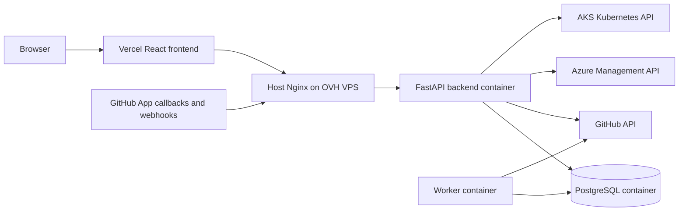

# Architecture

The backend follows a layered architecture designed to keep HTTP concerns, business logic, persistence, and external integrations separate.

## Goals

- Keep FastAPI routers thin.
- Keep business rules in services.
- Keep database access in repositories.
- Keep GitHub and AI SDK usage behind integration clients.
- Use typed Pydantic schemas for all HTTP inputs and outputs.
- Make services testable with mocked integrations.

## Runtime Components

Local development:

```txt
client
  -> Nginx
  -> FastAPI backend
  -> PostgreSQL

worker
  -> PostgreSQL jobs table
  -> GitHub API when required
```

The local Docker Compose stack runs:

- `postgres`: PostgreSQL database and persistent Docker volume.
- `backend`: FastAPI API server.
- `worker`: database-backed job runner.
- `nginx`: local reverse proxy for `/api`, `/docs`, and `/openapi.json`.

Validated production:



In production, host Nginx terminates HTTPS and proxies to the backend on `127.0.0.1:8000`. The Docker Compose Nginx service remains useful locally, but public production traffic is handled by host Nginx.

## Code Layers

```txt
app/api/
  FastAPI routers and dependency wiring.

app/schemas/
  Pydantic request and response models.

app/services/
  Business logic and workflow orchestration.

app/repositories/
  SQLAlchemy queries and persistence operations.

app/domain/
  SQLAlchemy models and domain enums.

app/integrations/
  External API clients, currently GitHub and OpenAI.

app/templates/
  Deterministic GitHub Actions templates.

app/worker/
  Job polling and asynchronous task handlers.
```

## Request Lifecycle

For a typical protected endpoint:

```txt
FastAPI router
  -> dependency validates JWT
  -> Pydantic validates request
  -> service enforces business rules and permissions
  -> repository reads or writes PostgreSQL
  -> service writes audit log when required
  -> Pydantic serializes response
```

Routers should not contain business logic. They should validate dependencies, accept typed payloads, and call services.

## Permission Model

Project-scoped actions are controlled through project membership:

```txt
owner       full project control, including member management
maintainer  repository onboarding, analysis, CI generation, secrets
viewer      read access
```

The service layer enforces these permissions before changing project, repository, CI, or secret state.

## Jobs

Longer operations use the `jobs` table:

- repository analysis
- CI generation when queued
- Pull Request creation when queued

The worker polls queued jobs and dispatches handlers. Results and failures are persisted so the frontend can poll `/api/v1/jobs/{job_id}`.

## External Integrations

### GitHub

The backend uses GitHub App installation tokens. It does not use permanent personal access tokens.

GitHub responsibilities are isolated in:

```txt
app/services/github_service.py
app/integrations/github/
```

### AI

AI is optional and never part of deterministic stack detection. It is used for:

- explaining generated CI YAML
- adapting a CI YAML draft after a user instruction

AI interactions are stored in `ai_interactions`.

### Azure AKS

The demo CD extension stores Azure Cloud Nodes in `cloud_targets`.

Global Cloud Nodes have:

```txt
cloud_targets.project_id = null
```

They are configured by platform admins and can be selected by repositories from any project.

For Azure CLI based deployment, platform secrets store:

```txt
AZURE_CLIENT_ID
AZURE_CLIENT_SECRET
AZURE_TENANT_ID
AZURE_SUBSCRIPTION_ID
```

The generated CD workflow uses these values as GitHub Actions secrets. Deployment status refresh uses Azure Management API to retrieve AKS credentials and then reads the Kubernetes Service from the AKS API.

## Auditability

Important actions are recorded in `audit_logs`, including:

- user login
- project creation
- GitHub installation linking
- repository import and analysis
- CI generation, adaptation, approval, and PR creation
- secret creation and update
- webhook receipt

## Database Migrations

Alembic manages schema changes. The backend container runs:

```bash
alembic upgrade head
```

before starting Uvicorn in the development Docker Compose setup.

In production, migrations also run automatically when the backend container starts. User bootstrap happens later during FastAPI startup, not during Alembic migrations.
