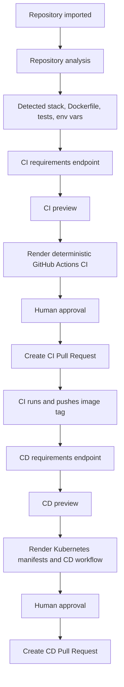
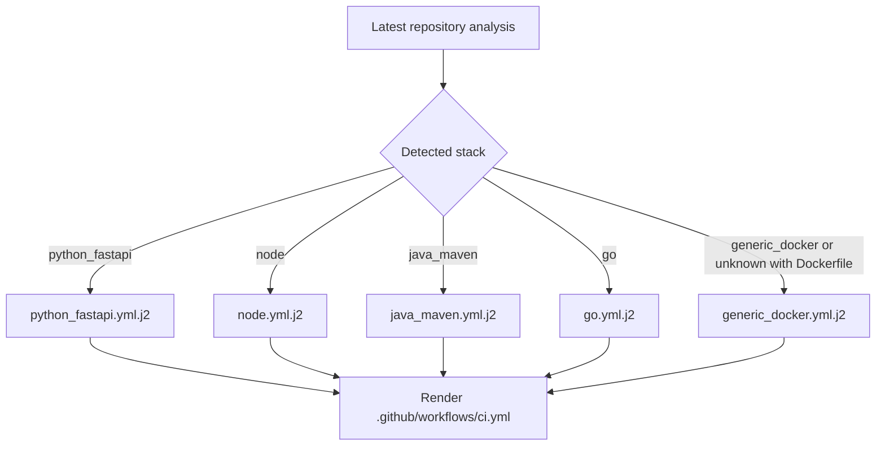
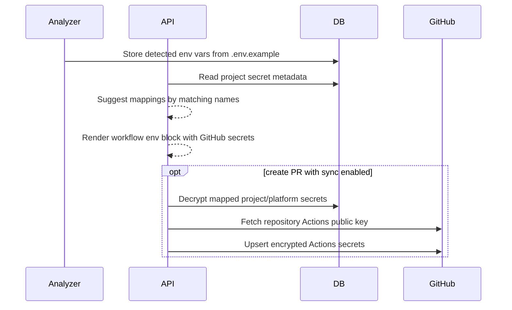
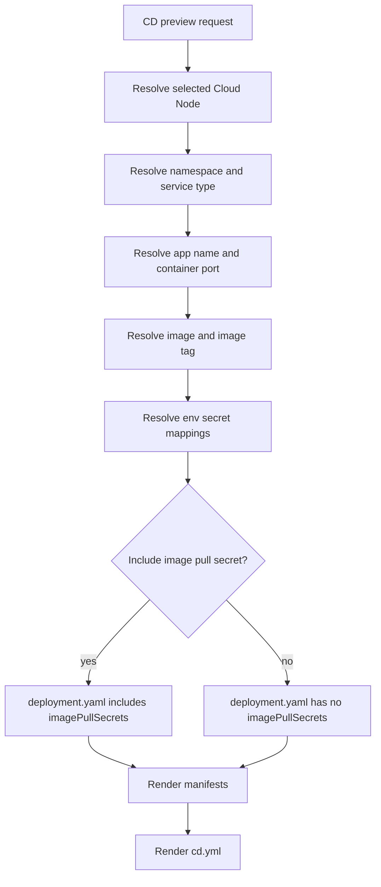
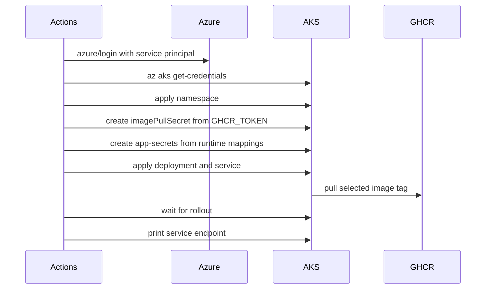
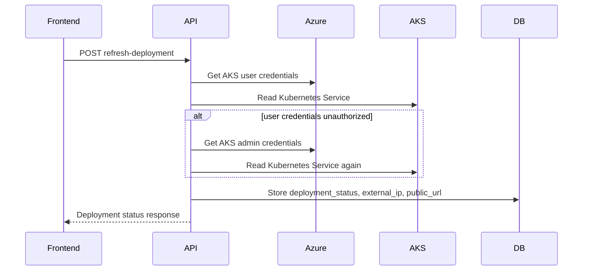

# CI/CD Generation Internals

This document explains how CNP generates CI workflows, CD workflows, and Kubernetes manifests.

The key design decision is that generation is deterministic by default. AI is allowed to explain or adapt CI drafts, but it is not part of base stack detection and it cannot bypass human approval.

## Generation Overview



## Repository Analysis Inputs

The analyzer reads the GitHub repository tree through the GitHub App installation token.

It detects:

```txt
Dockerfile presence and path
existing .github/workflows files
dependency manifests
test files or test scripts
language/framework indicators
.env.example-style files
```

Supported deterministic stack types:

```txt
python_fastapi
node
java_maven
go
generic_docker
unknown
```

Detection is based on repository files, not AI.

## CI Template Selection



CI templates live in:

```txt
apps/backend/app/templates/ci/github_actions/
```

The template context includes:

```txt
repository_full_name
stack
language version
test command
dockerfile path
image name
registry
push_on_main
env secret mappings
```

## CI Workflow Shape

The generated CI workflow usually contains:

```txt
name: CI
on: pull_request and push to main
permissions: contents read, packages write when registry push is enabled
checkout
language setup
dependency install
tests or "Tests not detected"
Docker build
optional registry login on main
optional Docker push on main
```

For GHCR push, the image is tagged with the commit SHA:

```txt
ghcr.io/<owner>/<repo>:${{ github.sha }}
```

That same SHA tag is later selected in the CD preview for reproducible deployment.

## CI Secret Mapping



Sources:

```txt
Project secrets with environment ci
Default platform registry secret for GHCR_TOKEN
```

Secret values are never returned by the API.

## AI Usage In CI

AI can be used for:

```txt
Explaining generated CI YAML
Adapting a CI draft after a user instruction
```

AI cannot:

```txt
commit directly to main
skip human approval
replace deterministic stack analysis
silently add untracked secrets
```

AI interactions are stored in `ai_interactions`.

## CD Generation Inputs

CD generation requires:

```txt
imported repository
latest repository analysis
selected Cloud Node
image name
image tag
container port
replica count
service type
kubeconfig strategy
secret mappings for runtime env vars
optional image pull secret
```

Global platform sources:

```txt
Default container registry -> GHCR_TOKEN
Global Cloud Node -> AZURE_CLIENT_ID, AZURE_CLIENT_SECRET, AZURE_TENANT_ID, AZURE_SUBSCRIPTION_ID
```

Project sources:

```txt
Runtime secrets from .env.example, stored under environment cd
Optional project-specific Cloud Target
```

## Kubernetes Manifest Generation

CD generation renders these files:

```txt
k8s/namespace.yaml
k8s/secret.yaml
k8s/deployment.yaml
k8s/service.yaml
.github/workflows/cd.yml
```

The Kubernetes manifests are generated from a deterministic render context, not from AI.



### `namespace.yaml`

Creates or configures the target namespace:

```yaml
apiVersion: v1
kind: Namespace
metadata:
  name: cnp-demo
```

### `secret.yaml`

Documents the application secret object shape. The actual secret values are created by the generated CD workflow using GitHub Actions secrets.

### `deployment.yaml`

Controls:

```txt
metadata.name = app_name
metadata.namespace = selected namespace
replicas = requested replica count
container image = image:image_tag
container port = requested container port
envFrom secretRef = app-secrets when runtime env vars exist
imagePullSecrets = ghcr-pull-secret when enabled
```

### `service.yaml`

Controls:

```txt
type = LoadBalancer for the demo
port = 80
targetPort = container port
selector app = app_name
```

## CD Workflow Shape

The generated `.github/workflows/cd.yml` runs on:

```txt
push to main
workflow_dispatch
```

For Azure CLI strategy, it performs:

```txt
checkout
setup kubectl
azure/login using AZURE_* secrets
az aks get-credentials
kubectl apply namespace
optional create/update GHCR image pull secret
create/update app-secrets from mapped GitHub secrets
kubectl apply deployment and service
kubectl set image deployment/<app> <app>=<image>:<tag>
kubectl rollout status
kubectl get service
```



## Deployment Status Refresh

After the CD workflow succeeds, CNP can refresh deployment status on demand.



The AKS service principal must have:

```txt
Reader
Azure Kubernetes Service Cluster User Role
Azure Kubernetes Service Cluster Admin Role
```

## Human Approval Boundaries

CNP requires approval before it writes generated files to a repository.

```txt
CI preview -> approve -> create CI PR
CD preview -> approve -> create CD PR
```

Generated PRs should be reviewed and merged in GitHub. The platform does not push directly to `main`.

