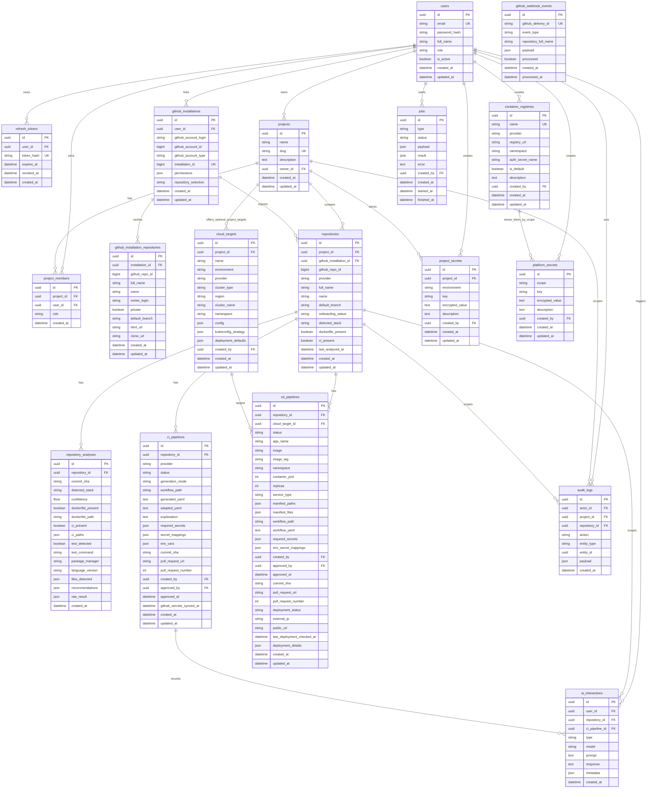

# Database Model

This document explains the PostgreSQL data model used by Cloud Native Platform V1.

The database is managed with Alembic migrations and SQLAlchemy async models. The implementation is intentionally repository-first: projects own imported repositories, repositories own analyses and generated CI pipelines, and all critical actions are auditable.

## Main Responsibilities

The database stores:

- platform users and refresh tokens
- projects and project memberships
- linked GitHub App installations
- cached GitHub installation repositories
- repositories imported into CNP projects
- deterministic repository analyses
- generated CI pipeline drafts and Pull Request metadata
- global and project-scoped Cloud Nodes for the AKS CD demo
- platform container registry metadata and encrypted registry credentials
- generated CD pipeline drafts, Kubernetes manifests, and Pull Request metadata
- encrypted project secrets
- background jobs
- audit logs
- AI interaction history
- GitHub webhook events

## Entity Relationship Diagram



## Ownership Boundaries

### User-Owned Data

`users` own:

- refresh tokens
- project ownership
- project memberships
- GitHub App installations
- started jobs
- audit events as actors
- AI interactions

User emails are unique. Passwords are never stored directly; only password hashes are persisted.

### Project-Owned Data

`projects` own:

- project members
- imported repositories
- optional project-scoped Cloud Nodes / cloud targets
- encrypted project secrets
- project-scoped audit logs

Project membership controls access to repository onboarding, CI generation, CD generation, and secret management.

Platform admins can list all projects, manage project Cloud Nodes, and manage global Cloud Nodes even when they are not explicit project members.

### Platform-Owned Data

Platform admins own global infrastructure configuration:

- global Cloud Nodes with `cloud_targets.project_id = null`
- container registry metadata in `container_registries`
- encrypted platform secrets in `platform_secrets`

Global Cloud Node secrets use a scope like:

```txt
cloud_target:<cloud_target_id>
```

Container registry tokens use a scope like:

```txt
container_registry:<container_registry_id>
```

### Repository-Owned Data

`repositories` own:

- stack analyses
- generated CI pipelines
- generated CD pipelines
- repository-scoped audit logs
- repository-scoped AI interactions

Imported repositories are unique per `(project_id, github_repo_id)`.

## Repository Analysis Data

`repository_analyses` stores one immutable analysis record per run.

Important fields:

- `detected_stack`: normalized stack type such as `python_fastapi`, `node`, `java_maven`, `go`, or `generic_docker`.
- `files_detected`: deterministic file signals found in the repository tree.
- `raw_result`: additional structured analysis output.
- `raw_result.env_vars`: detected environment variables from `.env.example`-like files.

Example `raw_result.env_vars`:

```json
[
  {
    "name": "DATABASE_URL",
    "source": ".env.example",
    "required": true,
    "sensitive": true,
    "default_value_present": false
  }
]
```

The `repositories` table keeps the latest summary fields for fast listing:

- `detected_stack`
- `dockerfile_present`
- `ci_present`
- `last_analyzed_at`
- `onboarding_status`

## CI Pipeline Data

`ci_pipelines` represents generated workflow drafts and their lifecycle.

Lifecycle:

```txt
draft
-> generated
-> adapted, optional
-> approved
-> pr_created
```

Important fields:

- `generated_yaml`: deterministic YAML generated by templates.
- `adapted_yaml`: AI-modified YAML, if requested.
- `required_secrets`: GitHub Actions secret names referenced by the workflow.
- `secret_mappings`: mapping between env var names, CNP project secret keys, and GitHub secret names.
- `env_vars`: env vars detected at generation time.
- `github_secrets_synced_at`: timestamp set when mapped secrets are pushed to GitHub Actions secrets.

Human approval is mandatory before Pull Request creation.

## Cloud Target Data

`cloud_targets` represents reusable deployment targets configured by platform admins.

Current demo support:

```txt
provider: azure
cluster_type: aks
```

Targets can be global or project scoped:

```txt
global cloud_targets, project_id null -> any project can select them for CD
project cloud_targets -> repositories in that project can select them for CD
```

Important fields:

- `config`: provider-specific values such as Azure tenant ID, subscription ID, and resource group.
- `kubeconfig_strategy`: metadata for `KUBECONFIG_CONTENT` or Azure CLI authentication.
- `deployment_defaults`: namespace, service type, public URL format, and manifest paths.

Target uniqueness:

```txt
(project_id, name) for project targets
name for global targets
```

## CD Pipeline Data

`cd_pipelines` represents generated CD workflow and Kubernetes manifest drafts.

Lifecycle:

```txt
generated
-> approved
-> pr_created
```

Important fields:

- `cloud_target_id`: the selected Cloud Node.
- `image` and `image_tag`: the container image selected during preview.
- `manifest_files`: generated Kubernetes manifests keyed by path.
- `workflow_yaml`: generated `.github/workflows/cd.yml`.
- `required_secrets`: GitHub Actions secrets referenced by CD.
- `env_secret_mappings`: mapping between detected runtime env vars, project secrets, GitHub secrets, and Kubernetes secrets.
- `deployment_status`: last known deployment state, such as `unknown`, `pending`, `deployed`, or `failed`.
- `external_ip` and `public_url`: public LoadBalancer endpoint after a successful refresh.
- `last_deployment_checked_at`: timestamp of the last Kubernetes Service refresh.

The backend refreshes deployment status on demand by reading the target Kubernetes Service.

## Secret Storage

`project_secrets` stores encrypted secret values.

`platform_secrets` stores encrypted admin-level infrastructure credentials, currently:

- Azure AKS Cloud Node secrets such as `AZURE_CLIENT_ID`, `AZURE_CLIENT_SECRET`, `AZURE_TENANT_ID`, and `AZURE_SUBSCRIPTION_ID`.
- default container registry credentials such as `GHCR_TOKEN`.

Security rules:

- `encrypted_value` is never returned by the API.
- Secret values are encrypted with `SECRET_ENCRYPTION_KEY`.
- API responses expose only metadata: key, environment, description, timestamps.
- Secret sync to GitHub decrypts values server-side and immediately encrypts them with the GitHub Actions public key before sending them to GitHub.
- Project runtime secrets remain project-scoped. Shared infrastructure secrets should be stored as platform secrets.

Uniqueness:

```txt
(project_id, environment, key)
```

## Jobs

`jobs` stores asynchronous operation state.

Supported V1 job types:

```txt
analyze_repository
generate_ci
commit_ci_pr
```

Supported statuses:

```txt
queued
running
succeeded
failed
```

The worker polls queued jobs and updates `started_at`, `finished_at`, `result`, and `error`.

## Audit Logs

`audit_logs` stores critical platform actions.

Examples:

```txt
user.login
project.created
github.installation.linked
repository.imported
repository.analyzed
ci.generated
ci.adapted_by_ai
ci.approved
ci.github_secrets_synced
ci.pr_created
secret.created
secret.updated
webhook.received
```

Audit logs are append-only operational records.

## Migrations

Alembic migrations live in:

```txt
apps/backend/alembic/versions/
```

Current important migrations:

```txt
202605200001_initial_schema.py
202605200002_ci_secret_mappings.py
202605300001_cd_support.py
202605300002_cd_deployment_status.py
202605300003_global_cloud_nodes_and_registries.py
```

The backend container runs:

```bash
alembic upgrade head
```

before starting Uvicorn.
