# Application Flows

This document visualizes the main Cloud Native Platform V1 flows.

The V1 product promise is:

```txt
A project owner connects GitHub, imports a repository with a Dockerfile, analyzes the stack, generates CI, reviews it, opens a Pull Request containing .github/workflows/ci.yml, then optionally generates CD for a registered AKS Cloud Node.
```

## High-Level Product Flow

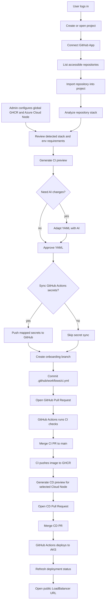

## Production Traffic Flow

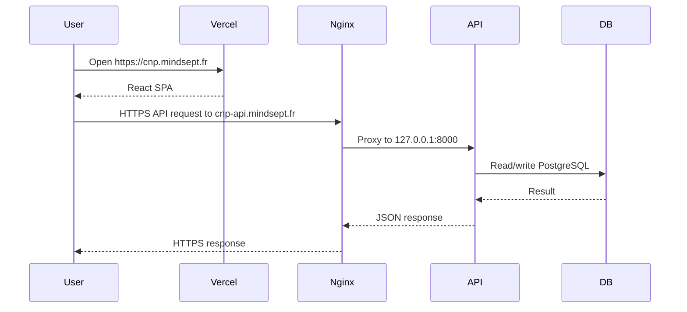

Vercel must rewrite all frontend routes to `/` so browser refreshes on `/github/callback`, `/admin/infrastructure`, and `/repositories/{id}/cd` load the React application instead of returning a platform 404.

## Authentication Flow

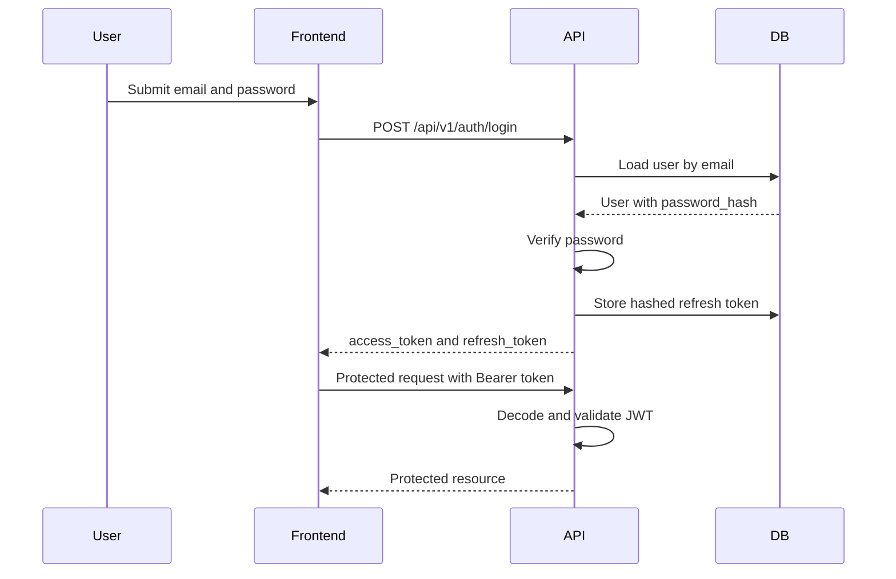

## GitHub App Connection Flow

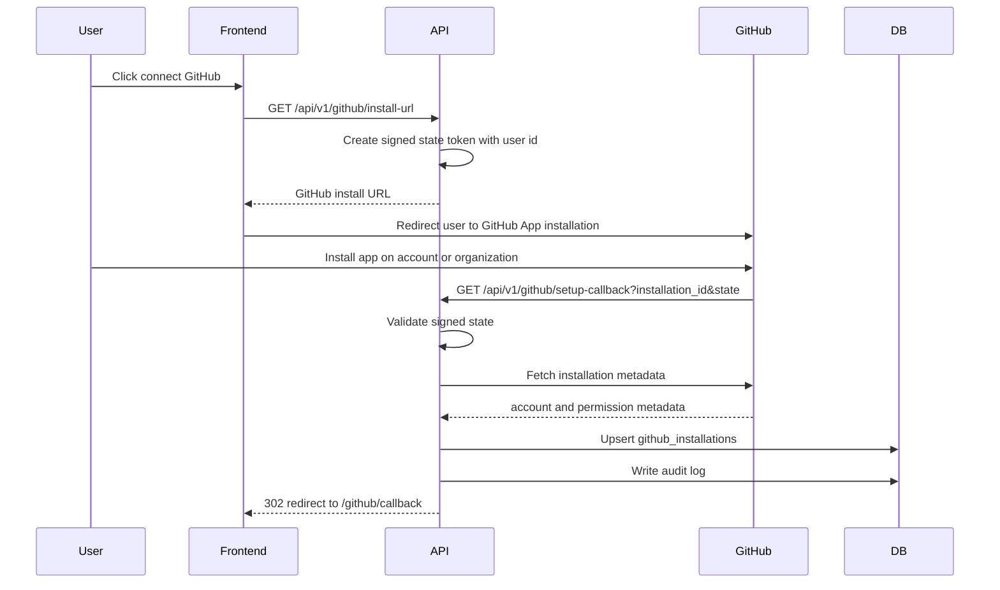

## Repository Import Flow

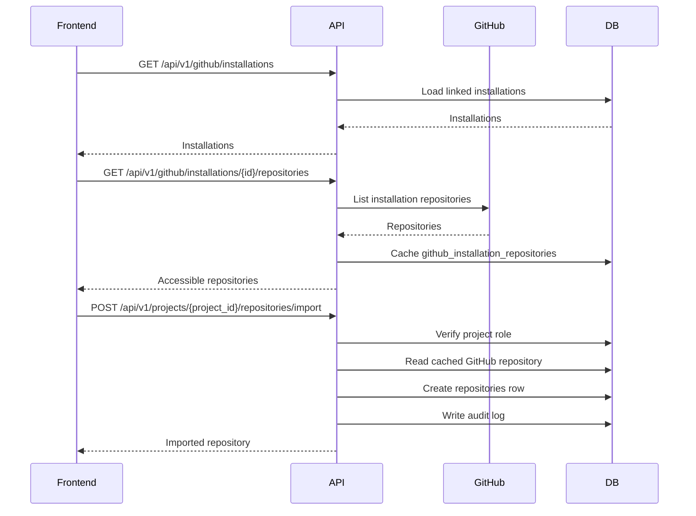

## Repository Analysis Flow

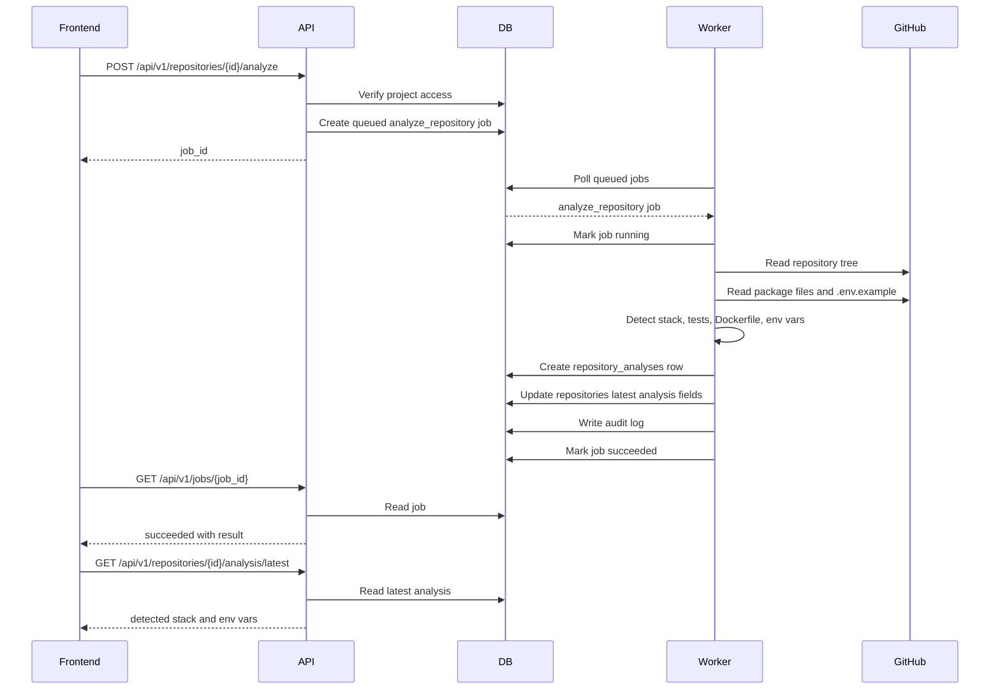

## CI Requirements and Secret Mapping Flow

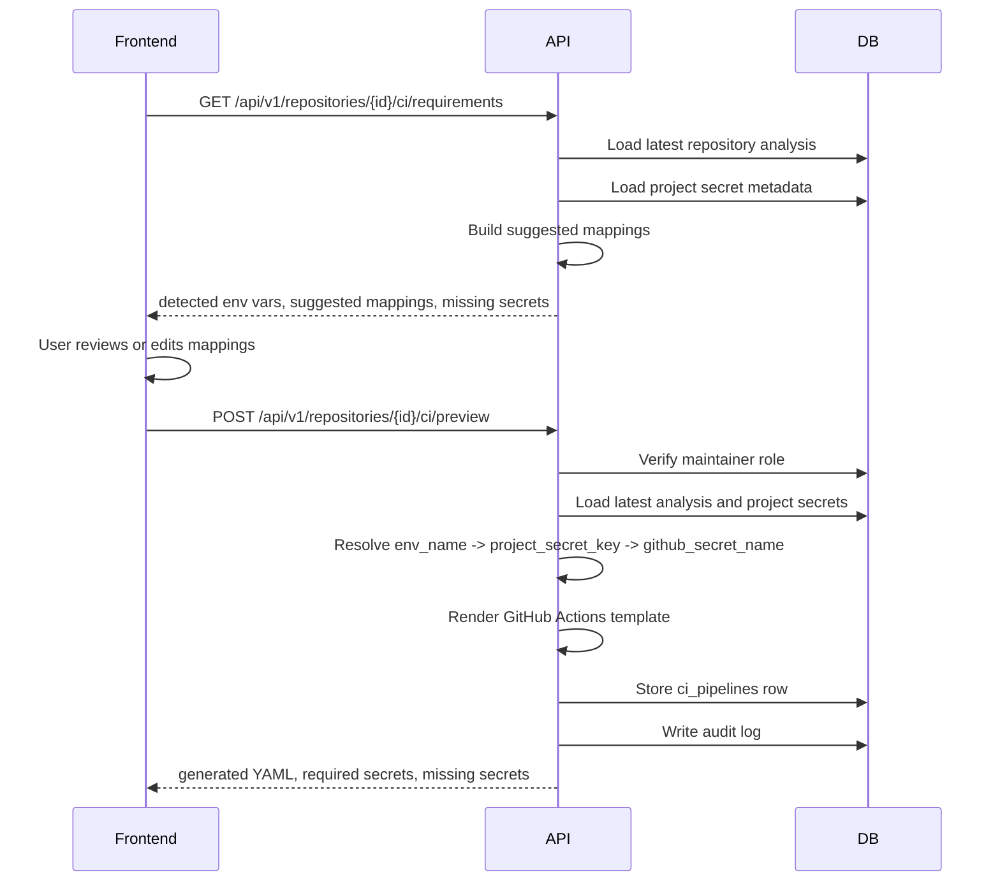

## CI Preview, Approval, and Pull Request Flow

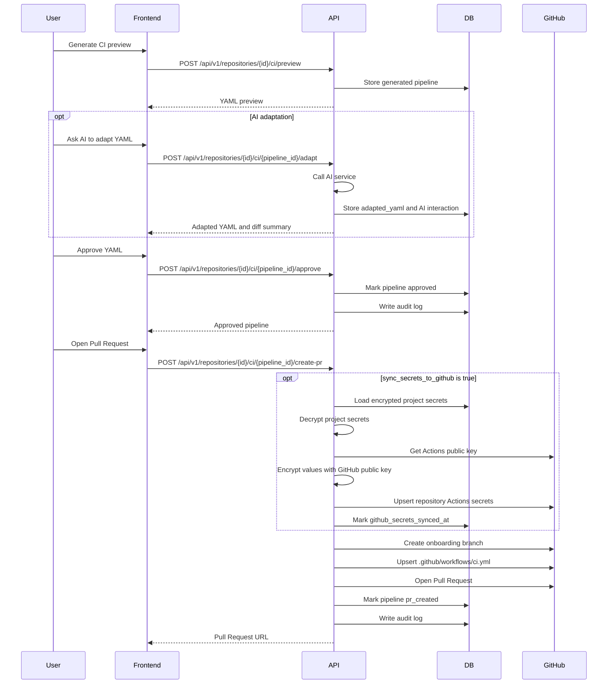

## Platform Registry Setup Flow

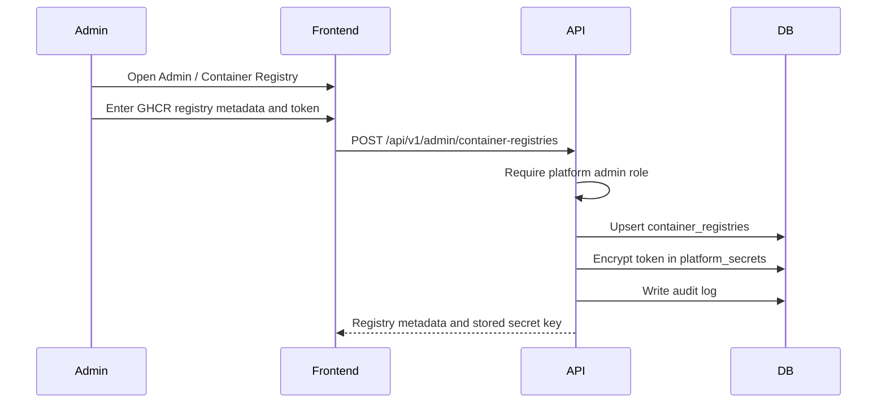

The default registry token is shared platform infrastructure. Project teams do not need to duplicate `GHCR_TOKEN` for the demo unless they want a project-specific override.

## Global Cloud Node Setup Flow

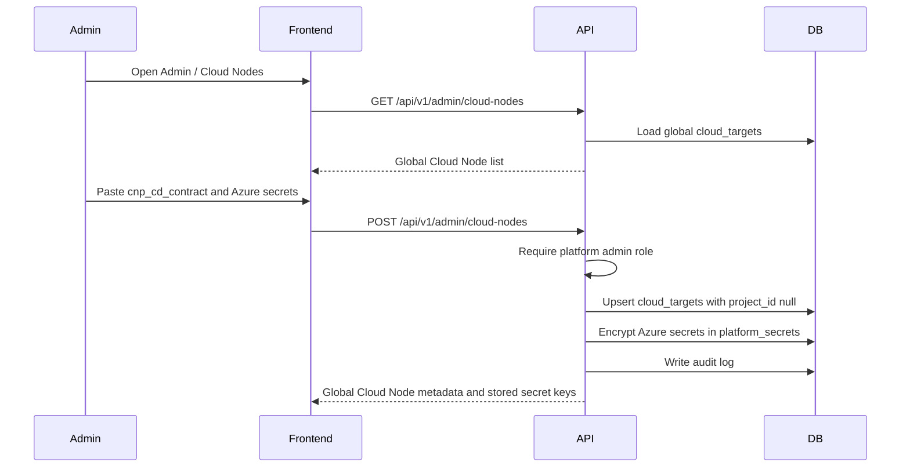

Global Cloud Nodes are reusable deployment targets. They are not tied to one repository or one project. Any project can list them through `GET /api/v1/projects/{project_id}/cloud-targets` and select one during CD generation.

## CD Preview, Approval, and Pull Request Flow

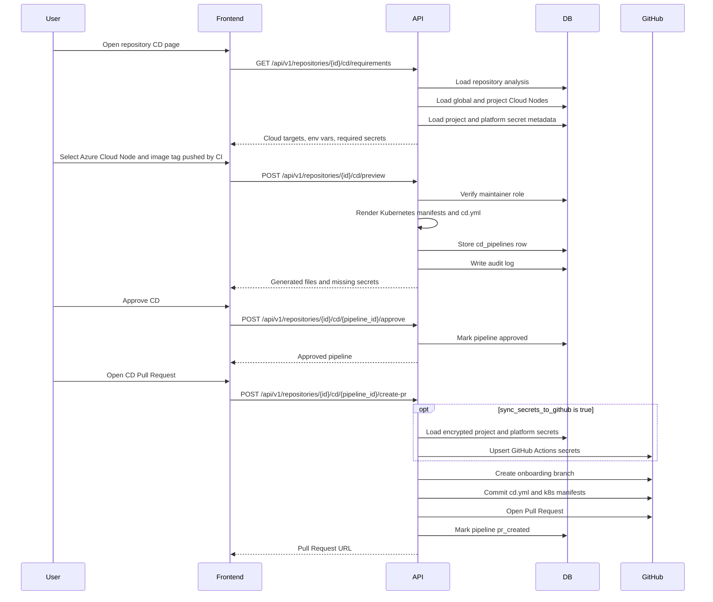

## AKS Deployment Result Flow

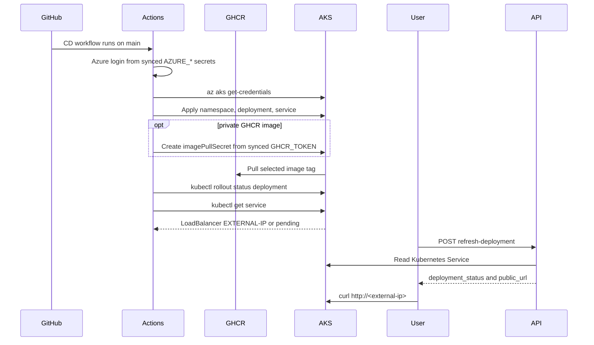

The current platform refreshes deployment status on demand. Automatic refresh from a GitHub webhook or background job is still future work.

## GitHub Actions Result Flow

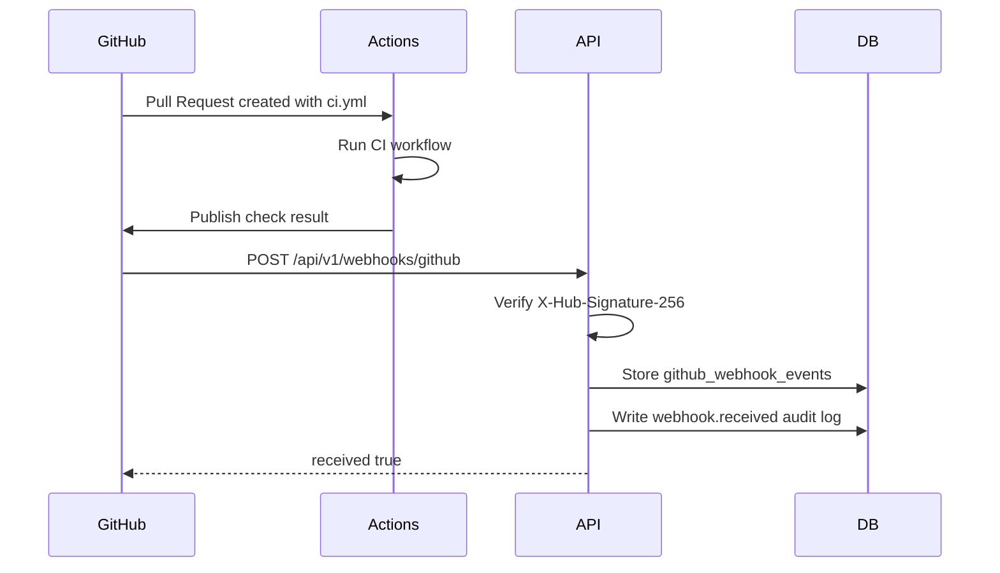

## Environment Secret Flow

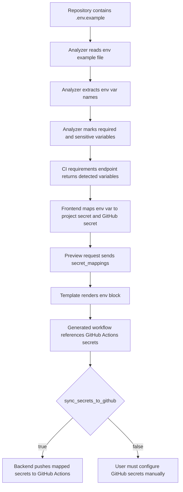

Generated YAML example:

```yaml
env:
  IMAGE_NAME: ghcr.io/example-org/api-orders
  DATABASE_URL: ${{ secrets.DATABASE_URL }}
```

## Permission Flow

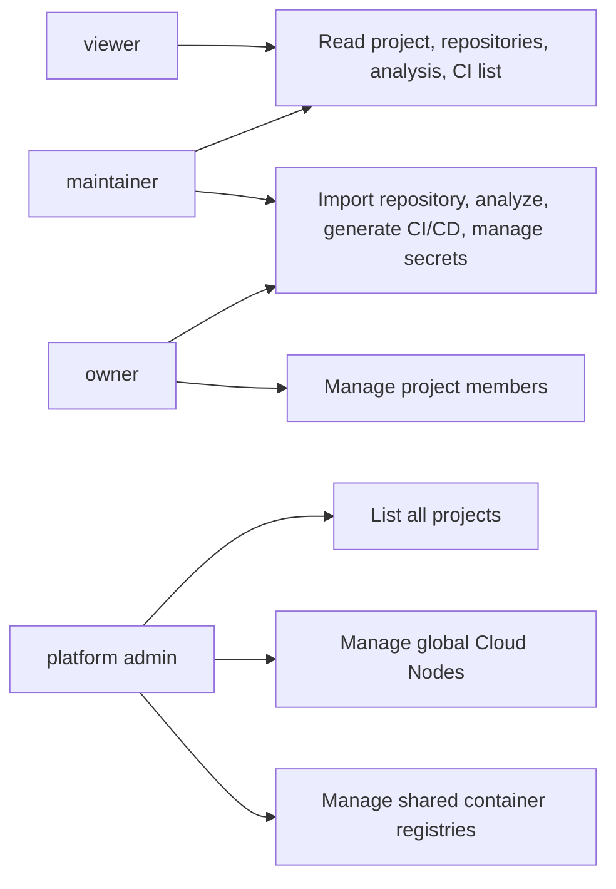

## CI/CD File Generation Flow

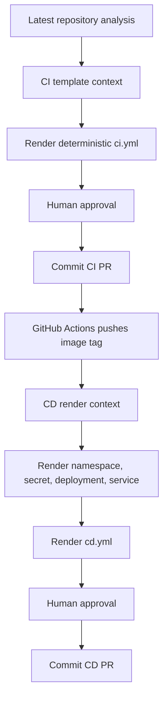

See [CI/CD Generation Internals](ci-cd-generation.md) for the exact generation rules.

## Failure Points to Watch

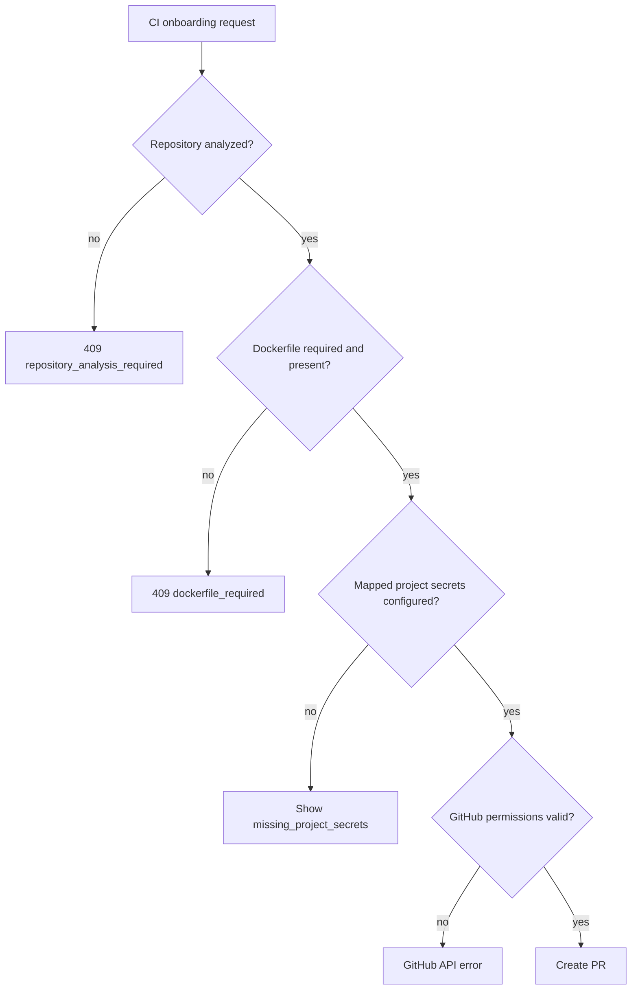
