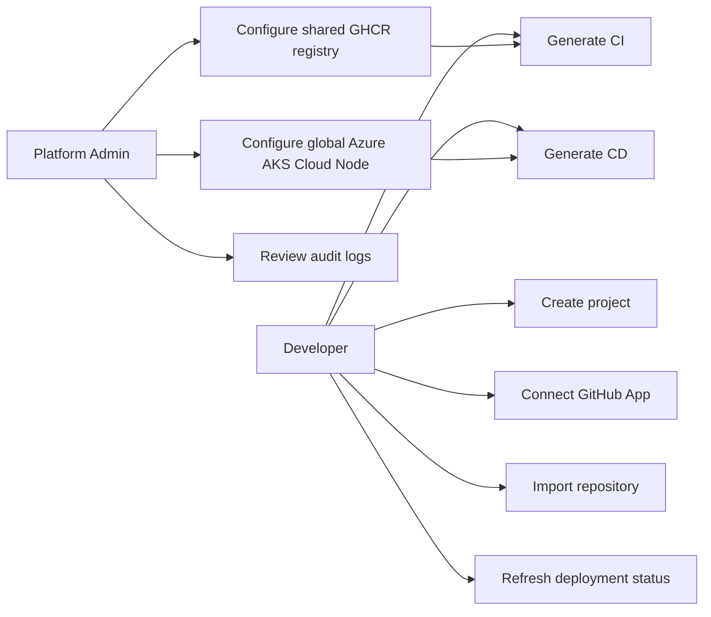
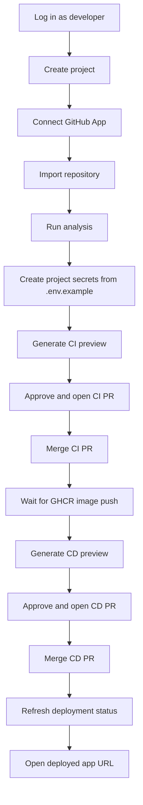

# Team Onboarding Runbook

This runbook is the shortest path for a team member to understand and use the Cloud Native Platform production demo.

## Production URLs

```txt
Frontend:    https://cnp.mindsept.fr
API base:    https://cnp-api.mindsept.fr/api/v1
Swagger UI:  https://cnp-api.mindsept.fr/docs
Health:      https://cnp-api.mindsept.fr/api/v1/health
```

The frontend is deployed on Vercel. The backend runs on an OVH VPS behind host Nginx and Let's Encrypt TLS.

## Accounts

Production access is allowlisted.

```txt
Admin account:
admin@mindsept.fr

Developer accounts:
hamza.hannat@epita.fr
elyes.benzina@epita.fr
henri-gabriel.dongmo@epita.fr
hugo.spyropoulos@epita.fr
leandro.tolaini@epita.fr
mathis.galliano@epita.fr
```

Passwords are provisioned from the backend production `.env`:

```env
BOOTSTRAP_ALLOWED_USERS_PASSWORD="<developer_password>"
BOOTSTRAP_ADMIN_USERS_PASSWORD="<admin_password>"
```

Do not commit or document the real passwords in the repository.

## Role Split



Admins configure shared platform infrastructure once. Developers then select that infrastructure from their project workflows.

## Admin First-Time Checklist

1. Log in as a platform admin.
2. Open `Admin -> Platform Infrastructure`.
3. Configure the default container registry:

```txt
provider: ghcr
registry_url: ghcr.io
auth_secret_name: GHCR_TOKEN
token: GitHub token with package read/write permissions
default: true
```

4. Configure the global Azure Cloud Node from the OpenTofu output:

```bash
cd IaC/Azure
tofu output -json cnp_cd_contract
```

5. Paste the contract into the Cloud Node form and provide:

```txt
AZURE_CLIENT_ID
AZURE_CLIENT_SECRET
AZURE_TENANT_ID
AZURE_SUBSCRIPTION_ID
```

6. Save the Cloud Node.

The admin setup is reusable for every project.

## Developer Demo Checklist



## Repository Requirements For A Smooth Demo

The easiest repository to demo is a small FastAPI app with:

```txt
Dockerfile
requirements.txt or pyproject.toml
app/main.py
tests/
.env.example
```

For a FastAPI container, the CD form usually uses:

```txt
Container port: 8000
Replicas: 1
Service type: LoadBalancer
Kubeconfig strategy: azure_cli
Include image pull secret: enabled when GHCR package is private
Image tag: exact commit SHA pushed by the CI workflow
```

## GitHub App Notes

Production GitHub App URLs must be:

```txt
Setup callback:
https://cnp-api.mindsept.fr/api/v1/github/setup-callback

Webhook:
https://cnp-api.mindsept.fr/api/v1/webhooks/github
```

The frontend callback route is:

```txt
https://cnp.mindsept.fr/github/callback
```

Vercel must include a SPA rewrite so direct navigation to routes such as `/github/callback`, `/admin/infrastructure`, and `/repositories/{id}/cd` returns `index.html` instead of a Vercel 404.

```json
{
  "rewrites": [
    {
      "source": "/(.*)",
      "destination": "/"
    }
  ]
}
```

## Troubleshooting Quick Checks

Backend health:

```bash
curl -s https://cnp-api.mindsept.fr/api/v1/health
```

Backend logs on the VPS:

```bash
cd ~/apps/cnp/CNP---API
docker compose -f docker-compose.yml logs backend --tail=150
```

Deployment status manual fallback:

```bash
az aks get-credentials --resource-group rg-cnp-demo --name aks-cnp-demo --overwrite-existing
kubectl -n cnp-demo get svc <app-name>
```

If a route refresh on the frontend returns a full 404, redeploy Vercel with `vercel.json` rewrites.

